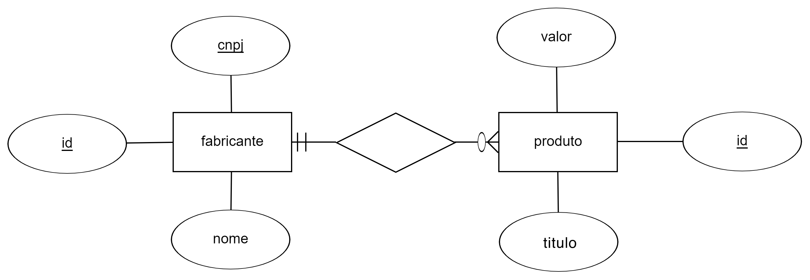

# Projeto Sites Linux

### Objetivo

Este projeto consiste na configuração/implantação de Sites WEB, utilizando ferramentas Linux, que representem a utilização e administração de uma aplicação empresarial.

### Nome do software

Fabricantes e Produtos

### Video

Clique [aqui](https://youtu.be/xpFSltsLHQQ) para visualizar o vídeo demonstrando acesso ao site Frontend e ao site Backend.

### Configurações do apache2

#### Frontend

```
<VirtualHost *:80>

    ServerName fabricanteseprodutos.com.br

    ServerAdmin joaocarlosm1234@gmail.com
    DocumentRoot /var/www/html/fabricanteseprodutos.com.br/

    ErrorLog ${APACHE_LOG_DIR}/fabricanteseprodutos.com.br/error.log
    CustomLog ${APACHE_LOG_DIR}/fabricanteseprodutos.com.br/access.log combined

</VirtualHost>

```

#### Backend

```
<VirtualHost *:80>

    ServerName fabricanteseprodutos.backend.biz

    ServerAdmin joaocarlosm1234@gmail.com
    DocumentRoot /var/www/html/fabricanteseprodutos.backend.biz/

    ErrorLog ${APACHE_LOG_DIR}/fabricanteseprodutos.backend.biz/error.log
    CustomLog ${APACHE_LOG_DIR}/fabricanteseprodutos.backend.biz/access.log combined

</VirtualHost>

```

### SQL

#### Diagrama ER



#### Comandos CREATE TABLE

```sql
CREATE TABLE fabricante
(
  id INTEGER UNSIGNED NOT NULL AUTO_INCREMENT,
  nome VARCHAR(100) NOT NULL,
  cnpj CHAR(14) NOT NULL,
  PRIMARY KEY (id),
  UNIQUE (cnpj)
);

CREATE TABLE produto
(
  id INTEGER UNSIGNED NOT NULL AUTO_INCREMENT,
  titulo VARCHAR(100) NOT NULL,
  valor FLOAT NOT NULL,
  id_fabricante INTEGER UNSIGNED NOT NULL,
  PRIMARY KEY (id),
  FOREIGN KEY (id_fabricante) REFERENCES fabricante(id)
);
```
